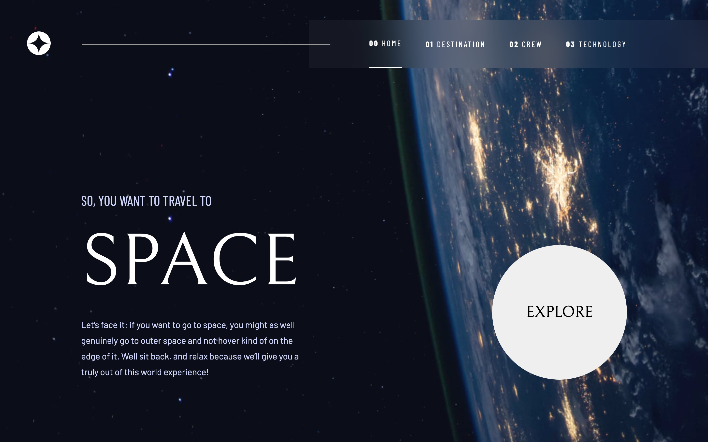
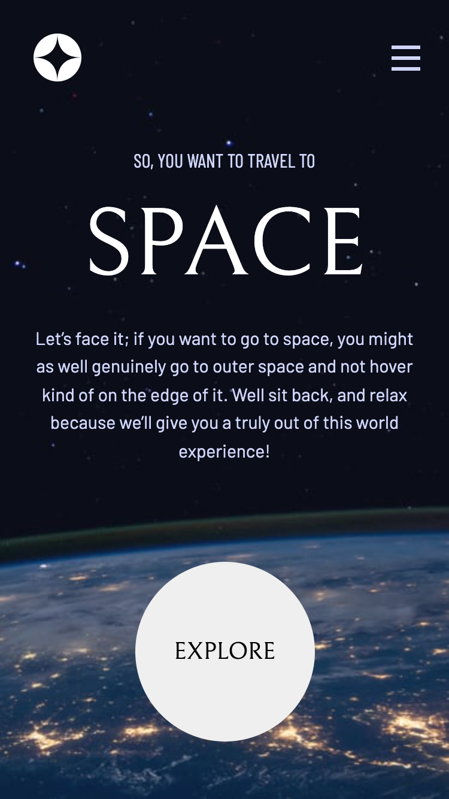

# Frontend Mentor - Space tourism website solution

This is a solution to the [Space tourism website challenge on Frontend Mentor](https://www.frontendmentor.io/challenges/space-tourism-multipage-website-gRWj1URZ3). Frontend Mentor challenges help you improve your coding skills by building realistic projects. 

## Table of contents

- [Overview](#overview)
  - [The challenge](#the-challenge)
  - [Screenshot](#screenshot)
  - [Links](#links)
- [My process](#my-process)
  - [Built with](#built-with)
  - [What I learned](#what-i-learned)
  - [Useful resources](#useful-resources)
- [Author](#author)


## Overview

### The challenge

Users should be able to:

- View the optimal layout for each of the website's pages depending on their device's screen size
- See hover states for all interactive elements on the page
- View each page and be able to toggle between the tabs to see new information

### Screenshot






### Links

- Solution URL: [Add solution URL here](https://your-solution-url.com)
- Live Site URL: [Add live site URL here](https://your-live-site-url.com)

## My process

### Built with

- Semantic HTML5 markup
- CSS custom properties
- Flexbox
- Mobile-first workflow
- React

### What I learned

This is what i learned. I learned how to use useLocation to be able to know the current url to make changes in the css of the page. I also learned how to import images from public folder to display the background images of the pages.

```js
 const location = useLocation();
 useEffect(() => {
    if (location.pathname === '/') {
      setUrl("home")
    } else if (location.pathname === '/destination') {
      setUrl("destination")
    } else if (location.pathname === '/crew') {
      setUrl("crew")
    } else {
      setUrl("technology")
    }
  }, [location.pathname]);

    useEffect(() => {
    document.body.style.background = `url(/images/${url}/background-${url}-${device}.jpg) no-repeat center / cover`
  }, [device, url])
```

### Useful resources

- [How to use the useLocation hook in React](https://www.educative.io/answers/how-to-use-the-uselocation-hook-in-react) - This helped me learn how to use useLocation.
- [React - import image from public folder](https://dirask.com/posts/React-import-image-from-public-folder-pJAQ7D) - This is an amazing article which helped me learn how to import images from public folder


## Author

- Frontend Mentor - [@andyjv1](https://www.frontendmentor.io/profile/andyjv1)

